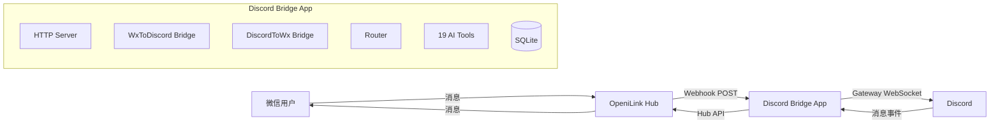

# @openilink/app-discord

[](https://nodejs.org/)
[](https://www.typescriptlang.org/)
[](https://discord.js.org/)
[](https://opensource.org/licenses/MIT)

**OpeniLink Hub App** -- 微信 ↔ Discord 双向消息桥接 + 19 个 AI Tools，覆盖消息、频道、成员、Embed、文件、管理六大模块。

> 本项目是 [OpeniLink Hub](https://github.com/openilink/openilink-hub) 的官方 App。Hub 是微信 Bot 的一站式管理平台，扫码绑定微信号即可使用。

---

## 功能亮点

- **微信 ↔ Discord 双向桥接**：微信消息自动转发到 Discord 频道（Embed 格式），Discord 回复自动转发回微信
- **自然语言操作 Discord**：在微信中说"在 Discord 发个消息说服务器维护完成"，Hub AI 自动调用 Discord API 完成操作
- **19 个 AI Tools，覆盖 6 大模块**：消息、频道、成员、Embed 富文本、文件、管理
- **Gateway 无需公网**：通过 Discord Gateway WebSocket 接收消息，只需出站网络即可，无需为 Bot 配置公网入口
- **安全验证**：Webhook 签名验证 + OAuth PKCE 安装流程
- **SQLite 持久化**：消息映射和安装记录存储在本地数据库，消息内容不落盘

---

## 使用方式

安装到 Bot 后，支持三种方式调用：

### 自然语言（推荐）

直接用微信跟 Bot 对话，Hub AI 会自动识别意图并调用对应功能：

- "在 Discord 发个消息说服务器维护完成"
- "查看 Discord 频道成员"
- "创建一个叫 dev-chat 的新频道"
- "踢掉某个违规用户"

### 命令调用

也可以使用 `/命令名 参数` 的格式直接调用：

- `/send_discord_message --channel_id 123 --text Hello`

### AI 自动调用

Hub AI 在多轮对话中会自动判断是否需要调用本 App 的功能，无需手动触发。

---

## 支持的 19 个 Tools

| 模块 | 工具 | 说明 |
|------|------|------|
| Messaging | `send_discord_message` | 发送文本消息 |
| | `reply_discord_message` | 回复指定消息 |
| | `edit_discord_message` | 编辑 Bot 消息 |
| | `delete_discord_message` | 删除消息 |
| | `get_message_history` | 获取消息历史 |
| | `add_reaction` | 添加表情反应 |
| Channels | `list_channels` | 列出服务器频道 |
| | `get_channel_info` | 获取频道详情 |
| | `create_channel` | 创建新频道 |
| | `create_thread` | 创建线程 |
| | `pin_message` | 固定消息 |
| Members | `get_user_info` | 获取用户信息 |
| | `list_members` | 列出服务器成员 |
| | `get_server_info` | 获取服务器信息 |
| | `list_roles` | 列出服务器角色 |
| Embed | `send_embed` | 发送 Embed 富文本消息 |
| Files | `upload_file` | 上传文件（受限提示） |
| Moderation | `kick_member` | 踢出成员 |
| | `ban_member` | 封禁成员 |

---

## 快速开始

### 应用市场一键安装（推荐）

在 [OpeniLink Hub](https://github.com/openilink/openilink-hub) 的应用市场中搜索「Discord」，一键安装即可使用，无需自行部署。

<details>
<summary><strong>自部署（Docker）</strong></summary>

```bash
docker compose up -d
```

或手动运行：

```bash
docker build -t openilink-app-discord .
docker run -d \
  -p 8083:8083 \
  -e HUB_URL="https://your-hub.example.com" \
  -e BASE_URL="https://your-app.example.com" \
  -e DISCORD_BOT_TOKEN="your-bot-token" \
  -e DISCORD_CHANNEL_ID="your-channel-id" \
  -v app-data:/data \
  openilink-app-discord
```

</details>

<details>
<summary><strong>环境变量</strong></summary>

| 变量 | 必填 | 默认值 | 说明 |
|------|------|--------|------|
| `HUB_URL` | 是 | - | OpeniLink Hub 地址 |
| `BASE_URL` | 是 | - | 本应用公网地址（用于 OAuth 回调和 Webhook） |
| `DISCORD_BOT_TOKEN` | 是 | - | Discord Bot Token |
| `DISCORD_CHANNEL_ID` | 是 | - | 默认消息转发频道 ID |
| `DB_PATH` | 否 | `data/discord.db` | SQLite 数据库路径 |
| `PORT` | 否 | `8083` | HTTP 服务端口 |

</details>

<details>
<summary><strong>从源码构建</strong></summary>

```bash
git clone https://github.com/openilink/openilink-app-discord.git && cd openilink-app-discord
npm install
cp .env.example .env
# 编辑 .env 填入你的配置

# 开发模式（热重载）
npm run dev

# 生产模式
npm run build
npm start
```

</details>

---

<details>
<summary><strong>Discord Bot 创建配置指南</strong></summary>

### 1. 创建应用

1. 登录 [Discord Developer Portal](https://discord.com/developers/applications)
2. 点击右上角 **New Application**
3. 输入应用名称（如 "OpeniLink Bridge"），点击 Create

### 2. 获取 Bot Token

1. 左侧菜单选择 **Bot**
2. 点击 **Reset Token**，复制并保存 Token
3. 注意：Token 只会显示一次，请妥善保存

### 3. 配置 Intents

1. 在 Bot 页面下方找到 **Privileged Gateway Intents**
2. 开启 `SERVER MEMBERS INTENT`
3. 开启 `MESSAGE CONTENT INTENT`
4. 点击 **Save Changes**

### 4. 生成邀请链接

1. 左侧菜单选择 **OAuth2 > URL Generator**
2. Scopes 勾选: `bot`
3. Bot Permissions 勾选:
   - `Send Messages`
   - `Read Message History`
   - `Manage Messages`
   - `Embed Links`
   - `Attach Files`
   - `Add Reactions`
   - `Manage Channels`
   - `Kick Members`
   - `Ban Members`
4. 复制底部生成的 URL

### 5. 邀请到服务器

1. 在浏览器中打开复制的 URL
2. 选择目标服务器，确认授权

### 6. 获取频道 ID

1. 在 Discord 客户端中开启开发者模式（设置 > 高级 > 开发者模式）
2. 右键点击目标频道，选择「复制频道 ID」

</details>

---

<details>
<summary><strong>架构与消息流转</strong></summary>

### 架构图



### 消息流转

1. **自动桥接（微信 -> Discord）**：Hub Webhook -> handleWebhook -> WxToDiscord -> Discord Embed
2. **自动桥接（Discord -> 微信）**：Discord Gateway -> registerMessageHandler -> DiscordToWx -> Hub API -> 微信
3. **自然语言命令**：Hub Webhook (command) -> Router -> Tool Handler -> Discord API -> 结果回复到微信
4. **AI 工具调用**：Hub 将 AI 选择的工具通过 command 事件发送，Router 分发到对应 handler 执行

</details>

---

<details>
<summary><strong>开发指南</strong></summary>

### 常用命令

```bash
# 安装依赖
npm install

# 开发模式
npm run dev

# 编译
npm run build

# 生产运行
npm start

# 运行测试
npm test

# 监视模式
npm run test:watch
```

### 项目结构

```
src/
  index.ts              # 主入口
  config.ts             # 环境变量配置
  store.ts              # SQLite 存储层
  router.ts             # 命令路由器
  hub/
    types.ts            # Hub 协议类型定义
    oauth.ts            # OAuth2 + PKCE 安装流程
    webhook.ts          # Webhook 签名验证与事件分发
    client.ts           # Hub Bot API 客户端
    manifest.ts         # App Manifest 声明
  discord/
    client.ts           # Discord SDK 封装
    event.ts            # Discord 消息事件监听
  bridge/
    wx-to-discord.ts    # 微信 -> Discord 消息转发
    discord-to-wx.ts    # Discord -> 微信消息转发
  tools/
    index.ts            # 工具聚合注册
    messaging.ts        # 消息操作工具（6 个）
    channels.ts         # 频道操作工具（5 个）
    members.ts          # 成员操作工具（4 个）
    embed.ts            # Embed 富文本工具（1 个）
    files.ts            # 文件上传工具（1 个）
    moderation.ts       # 管理操作工具（2 个）
  utils/
    crypto.ts           # 签名验证与 PKCE
```

</details>

---

## 安全与隐私

### 数据处理说明

- **消息内容不落盘**：本 App 在转发消息时，消息内容仅在内存中中转，**不会存储到数据库或磁盘**
- **仅保存消息 ID 映射**：数据库中只保存消息 ID 的对应关系（用于回复路由），不保存消息正文
- **用户数据严格隔离**：所有数据库查询均按 `installation_id` + `user_id` 双重过滤，不同用户之间完全隔离，无法互相访问

### 应用市场安装（托管模式）

通过 OpeniLink Hub 应用市场一键安装时，消息将通过我们的服务器中转。我们承诺：

- 不会记录、存储或分析用户的消息内容
- 不会将用户数据用于任何第三方用途
- 所有 App 代码完全开源，接受社区审查
- 我们会对每个上架的 App 进行严格的安全审查

### 自部署（推荐注重隐私的用户）

如果您对数据隐私有更高要求，建议自行部署本 App。自部署后所有数据仅在您自己的服务器上流转，不经过任何第三方。

## License

[MIT](LICENSE)
